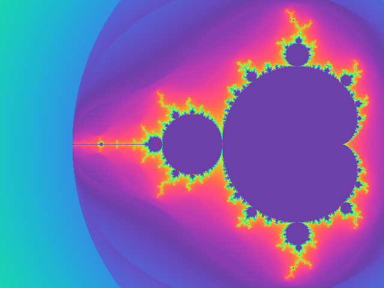

# Cinefractal documentation




Welcome to Cinefractal, the Python library for static and animated escape fractals written in Rust.

The library consists of mainly three parts:

1. The general library for generating fractal information as an iteration or color field.
2. A key frame animation system to animate the diverse features of the library.
3. An autofocus system that looks for interesting parts of the fractal by a variance based heuristic.


```{toctree}
:maxdepth: 1
:caption: Contents:

getting_started
overview
API Reference <apidocs/cinefractal/cinefractal>
```


