# Overview

The overall system consists mainly of three modules:

1. The [iteration field interface](#iter), which generates the iteration field or a color field based on various parameters.
2. The [animation system](#animation) is a keyframe-based animation system that can manipulate the parameters of the iteration field interface over time.
3. The [focal system](#focus), which provides information on interesting points of an iteration field. These points may, as a result, be used to steer the animation system.

A sketch of the system's structure can be found in the [summary](#summary) section.


(iter)=
## Iteration Field Interface

The iteration field interface provides functionality to generate the following escape time fractals:

| fractal name                                                                   | image                                        |
|--------------------------------------------------------------------------------|----------------------------------------------|
| [Mandelbrot](https://en.wikipedia.org/wiki/Mandelbrot_set)                     | 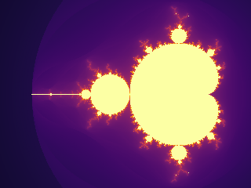 |
| [Julia](https://en.wikipedia.org/wiki/Julia_set) (combined with seeding value) |                  |
| [Burning Ship](https://en.wikipedia.org/wiki/Burning_Ship_fractal)             | 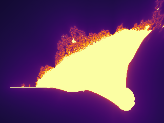     |
| [Tricorn](https://en.wikipedia.org/wiki/Tricorn_(mathematics))                 | 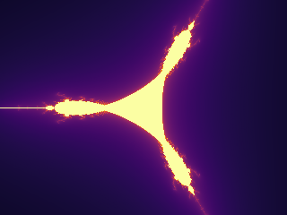               | 
| [Celtic](https://fractal.fandom.com/wiki/Celtic)                               | 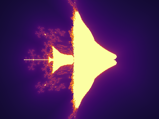                 | 

All of them can be combined with an exponent that is used in the iteration expression on complex numbers and should always be >=2.
The most prominent of the five fractals are the Mandelbrot and Julia sets.

In total, the synthesized iteration field for the escape time is determined by the following parameters set with the
corresponding methods in [`IterationFieldInterface`](#cinefractal.IterationFieldInterface). All of them have a default value if not explicitly set.

| Parameter                                                       | Setting Method         | Default Value |
|-----------------------------------------------------------------|------------------------|---------------|
| Image Size in Rows, Columns                                     | set_numpy_extension    | 1024x768      |
| Fractal Type                                                    | set_fractal_type       | Mandelbrot    | 
| Exponent used in iteration scheme                               | set_fractal_exponent   | 2             |
| Seed Value for Julia set                                        | set_fractal_seed_value | 0, 0          |
| Maximum iterations probed                                       | set_maximum_iterations | 1000          |
| The extension in complex numbers which are shown in the window  | set_extension          | 1.5           |
| Screen center point in complex number pane                      | set_center_point       | 0, 0          |

Querying the result can be done by three methods:

1. [`get_discrete_iteration_field`](#cinefractal.IterationFieldInterface.get_discrete_iteration_field): gets a two-dimensional numpy array of int indicating the number of iterations till escape.
2. [`get_continuous_iteration_field`](#cinefractal.IterationFieldInterface.get_continuous_iteration_field): gets a two-dimensional numpy array of floats, which is a smoothed version of the iteration field.
3. [`get_color_field`](#cinefractal.IterationFieldInterface.get_color_field): gets a three-dimensional numpy array of uint8 containing mapped colors from the iterations field. The color mapping method is explained in the following paragraph.

The ready colorized fields can be displayed and saved with the `Image` class from `PIL`.


### Colorization
For the colorization, several base options are offered:

| name        | sample image                     |
|-------------|----------------------------------|
| viridis     | 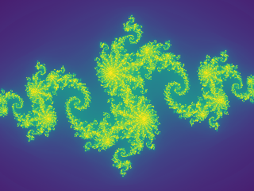   |
| cyclical(2) | 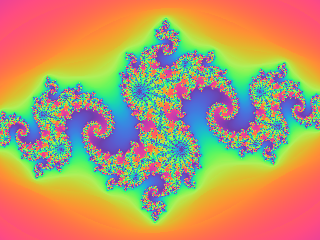 |
| inferno     |    |
| magma       | 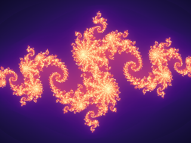       |
| plasma      | 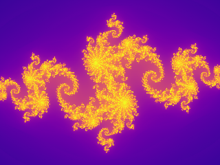     |
| cool        | 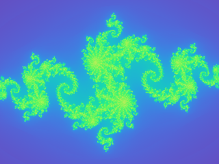         |

These are set by:

```python
ifi = IterationFieldInterface() 
ifi.set_colorization_information(ColorSystem.viridis(), False)
```

The last parameter of the command `ifi.set_colorization_information(ColorSystem.cool(), False)`
indicates whether we want to work on a **discretized** iteration field (=True) for coloring or a **continuous** iteration field
(=False) that takes into account the exact iteration result when divergence has been obtained.

| discrete field                                      | continuous field                             |
|-----------------------------------------------------|----------------------------------------------|
| 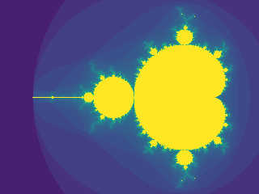 |  |

The next and last relevant parameter for visualization is the logarithmic strength. This parameter increases the resolution of low iteration values.

```python
ifi = IterationFieldInterface() 
ifi.set_colorization_information(ColorSystem.viridis(), False)
ifi.set_colorization_log_strength(0.5)
```
These are shown in the following examples.

| log strength = 0.0                                | log strength = 2.0                                   |
|---------------------------------------------------|------------------------------------------------------|
| 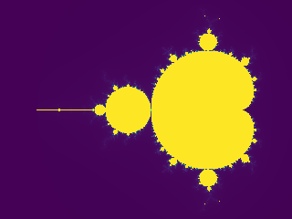 | 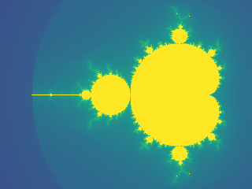 |

### Example
An example to generate the typical Mandelbrot image.

```python
from PIL import Image
from cinefractal import IterationFieldInterface, ColorSystem

WIDTH = 1280
HEIGHT = 1024
IMAGE_NAME = "mandelbrot.png"

ifi = IterationFieldInterface()
ifi.set_numpy_extension(HEIGHT, WIDTH)
ifi.set_maximum_iterations(1000)
ifi.set_center_point(-1.0, 0.0)
ifi.set_extension(1.2)
ifi.set_colorization_information(ColorSystem.cyclical(3.0), False)
ifi.set_colorization_log_strength(0.5)

print("Computing mandelbrot fractal...")
color_field = ifi.get_color_field()

image = Image.fromarray(color_field)
image.save(IMAGE_NAME)
image.show()
print(f"File saved at {IMAGE_NAME} with resolution {WIDTH}x{HEIGHT}")
```

(animation)=
## Animation
The animation system is a keyframe-based system designed to steer the [`IterationFieldInterface`](#cinefractal.IterationFieldInterface).
In combination with the package `MoviePy`, MP4 videos can be easily constructed.

The animation system consists of two main classes:

1. The [`AnimationRecorder`](#cinefractal.AnimationRecorder): This class takes the key frame information of what should happen when in the movie. The animation recorder can generate an AnimationPlayer.
2. The [`AnimationPlayer`](#cinefractal.AnimationPlayer): The animation player can simply be asked for the length of the clip and can be asked to manifest its data to the `IterationInterfaceField` for a certain time. Animation can not be changed anymore in the animation player.

The parameters and defaults of the [`AnimationRecorder`](#cinefractal.AnimationRecorder) are comparable with those of the  [`IterationFieldInterface`](#cinefractal.IterationFieldInterface).
The main difference is that timings are specified for the keyframe positions.


Parameters and setting methods are specified in the following table:

| Parameter                                                        | Setting Method                   | Default Value |
|------------------------------------------------------------------|----------------------------------|---------------|
| Exponent used in iteration scheme                                | set_keyframe_exponent            | 2             |
| Seed Value for Julia set                                         | set_keyframe_fractal_seed_value  | 0, 0          |
| Maximum iterations probed                                        | set_keyframe_max_iterations      | 1000          |
| The extension in complex numbers which are shown in the window   | set_keyframe_extension           | 1.5           |     
| Screen center point in complex number pane                       | set_keyframe_render_center_point | 0, 0          |
| The log strength for coloring fractals                           | set_keyframe_log_strength        | 0.0           |

Most of the values can also be specified by the [constructor](#cinefractal.AnimationRecorder.__new__) of the
animation recorder.

The procedure of using that system is to set up an `IterationFieldInterface` first. Then specify your animation with the
[`AnimationRecorder`](#cinefractal.AnimationRecorder). Once it is done, use the `get_animation_player` method to obtain an [`AnimationPlayer`](#cinefractal.AnimationPlayer).
Now set up a MoviePy movie and use the combination of `apply_animation` to the [`IterationFieldInterface`](#cinefractal.IterationFieldInterface)
and `get_color_field` to ask for a numpy array that can be recorded with MoviePy.

### Example
Render an animated Julia zoom to an MP4 file using moviepy.

A Julia set with a fixed start value (-0.8, 0.156) animated in three segments:
zoom in (radius 1.5 -> 1e-4), zoom back out (-> 0.1), then pan to the right
while holding the radius. Demonstrates several animation tracks (radius and
center point) with hold key frames.

The animation system mutates the IterationFieldInterface each frame; we then ask
the interface for its color field, which is already a (rows, cols, 3) uint8
array -- exactly the frame format moviepy expects.

```python
from moviepy import VideoClip

from cinefractal import (
    AnimationRecorder,
    ColorSystem,
    FractalType,
    IterationFieldInterface,
)

WIDTH = 1280
HEIGHT = 720
FPS = 30
SEGMENT = 6.0  # seconds per animation segment; total duration is 3 * SEGMENT

# --- Build the animation ---------------------------------------------------
# The constructor seeds time 0. Defaults mirror IterationFieldInterface, so we
# only override what we animate or want different from the start.
animation = AnimationRecorder(
    exponent=2,
    # log color scaling (mapped via exp_m1 internally), so the fast-escaping
    # zoom stays colorful. exp_m1(2.0) ~= 6.4, a moderate strength.
    log_strength=2.0,
    max_iterations=1000,
)
# Constant Julia start value (set as the seed at t = 0).
animation.set_keyframe_fractal_seed_value(0.0, -0.8, 0.156)
# Segment 1 (0 .. SEGMENT): logarithmic zoom in, extension 1.5 -> 1e-4.
animation.set_keyframe_extension(SEGMENT, 1e-4)
# Segment 2 (SEGMENT .. 2*SEGMENT): zoom back out to 0.1.
animation.set_keyframe_extension(SEGMENT * 2, 0.1)
# Hold the center at the origin through both zoom segments.
animation.set_keyframe_render_center_point(SEGMENT * 2, 0.0, 0.0)
# Segment 3 (2*SEGMENT .. 3*SEGMENT): pan to the right (extension held at 0.1).
animation.set_keyframe_render_center_point(3 * SEGMENT, 1.0, 0.0)
animation = animation.get_animation_player()
duration = animation.max_time()

# --- Configure the field interface (type / size / colors set once) ---------
ifi = IterationFieldInterface()
ifi.set_numpy_extension(HEIGHT, WIDTH)
# Only the fractal *type* needs to be set here; exponent and seed value are
# driven by the animation every frame.
ifi.set_fractal_type(FractalType.julia())
ifi.set_colorization_information(ColorSystem.inferno(), False)


def make_frame(t):
    """Render the frame at time `t` (seconds)."""
    animation.apply_animation(t, ifi)
    # (rows, cols, 3) uint8 -- the exact frame layout moviepy wants.
    return ifi.get_color_field()


clip = VideoClip(make_frame, duration=duration)

output_path = "julia_zoom.mp4"
print(f"Rendering {duration:.1f}s at {WIDTH}x{HEIGHT}, {FPS} fps -> {output_path}")
clip.write_videofile(output_path, fps=FPS)
print(f"Done: {output_path}")
```

(focus)=
## Focal System
The focal system searches for interesting points in a fractal escape-iteration field based on local variance.
Its structure is a two-tiered system roughly comparable to the [animation system](#animation).

The focal system consists of two main classes:
1. The [FocalSystemInterface](#cinefractal.FocalSystemInterface): This system can be parametrized for which focal points to look. For the system to work correctly, the parametrization must be consistent with the [animation system](#animation) and the [iteration interface](#iter). After parametrization is done, a [FocalPointResult](#cinefractal.FocalPointResult) can be obtained to query focal points.
2. The [FocalPointResult](#cinefractal.FocalPointResult): This class represents a collection of the focal points asked for. They can be sorted by various criteria and returned in several formats.

The parametrization methods for the [FocalSystemInterface](#cinefractal.FocalSystemInterface) are as follows.
It is the user's responsibility to keep this consistent with the parameters set [animation system](#animation) and the [iteration interface](#iter) system.
Special attention has to be paid to the fact that the animation system changes values over time. So it is best to query
focal points for a defined parameter set at a defined keyframe in the animation. Inconsistent parametrization will not result
in a runtime error but in a wrong determination of focus points.

| Parameter                                                                                                  | Setting Method           | Default Value |
|------------------------------------------------------------------------------------------------------------|--------------------------|---------------|
| Exponent used in iteration scheme                                                                          | set_fractal_exponent     | 2             |
| The fractal type used to calculate the focal point                                                         | set_fractal_type         | Mandelbrot    |
| Seed Value for Julia set                                                                                   | set_fractal_seed_value   | 0, 0          |
| Maximum iterations probed                                                                                  | set_maximum_iterations   | 1000          |
| The extension in complex numbers for the region to search points in                                        | set_extension            | 1.5           |
| The minimum distance all searched points have to be away from the search center                            | set_extension_min        | 0.0           |
| The render extension the points are judged at (smaller = deeper zoom), decoupled from the search extension | set_evaluation_extension | 1.5           |
| Screen center point in complex number pane                                                                 | set_center_point         | 0, 0          |

Most of the values can also be specified by the [constructor](#cinefractal.FocalSystemInterface.__new__) of the
focal system interface.

Once the [FocalSystemInterface](#cinefractal.FocalSystemInterface) has been constructed, a  [FocalPointResult](#cinefractal.FocalPointResult) structure can be obtained
with the method [create_collection_of_points](#cinefractal.FocalSystemInterface.create_collection_of_points), which
requires the number of focal points to obtain. It will pick the best ones based on the variance quality metric.
The resulting  [FocalPointResult](#cinefractal.FocalPointResult) has three methods to obtain the focal points in different orders and characteristics
as a list of tuples. They can either be ordered by evaluation quality or by distance ([see here](#cinefractal.PathGenerationCriterion)).
Here the method [get_path_from_start_point_with_distance](#cinefractal.FocalPointResult.get_path_from_start_point_with_distance) is the most
interesting because the distance information can be used for timing purposes, as shown in the example below.
In methods that receive an explicit starting point, that point is included in the returned path. The path elements
can then be used to generate key frames for the animation system.


### Example
Autofocus + animated Julia tour rendered to an MP4 with moviepy.

This combines the autofocus logic of the native `fractal_viz` demo with the
movie-rendering structure of `julia_zoom_movie.py`:

1. The focal system scatters candidates in a coarse search region and keeps
   the most interesting ones (highest local variance), judged at a deep
   evaluation scale.
2. Those kept points are ordered into a short tour, annotated with the
   cumulative travel distance.
3. That distance drives the timing of an AnimationRecorder: the camera pans to
   each point (at constant speed), then zooms in to detail scale and back out
   before traveling on.
4. moviepy renders the resulting AnimationPlayer frame by frame.


```python
from moviepy import VideoClip

from cinefractal import (
    AnimationRecorder,
    ColorSystem,
    FocalSystemInterface,
    FractalType,
    IterationFieldInterface,
    PathGenerationCriterion,
)

# --- Render settings -------------------------------------------------------
WIDTH = 1280
HEIGHT = 720
FPS = 30

# --- Fractal / autofocus settings (mirrors the fractal_viz demo) -----------
JULIA_SEED = (-0.8, 0.156)
MAX_ITERATIONS = 300

COARSE_SCALE = 1.5          # extension we hover at between zooms
COARSE_SEARCH_SCALE = 2.0   # radius we scatter search candidates in
DETAIL_SCALE = 1e-4         # extension we dive to at each point (smaller = deeper zoom)

NUM_FOCAL_POINTS = 5       # how many interesting points to keep / visit
START_POINT = (-1.5, 0.0)   # where the camera tour starts

# --- Timing ----------------------------------------------------------------
TRAVERSAL_SECONDS = 4.0     # total time spent panning across the whole tour
ZOOM_TIME = 4.0             # seconds per zoom phase (in and out separately)


def build_animation():
    """Run the autofocus search and turn the resulting tour into a player."""
    animation = AnimationRecorder(
        exponent=2,
        log_strength=2.0,
        max_iterations=MAX_ITERATIONS,
        extension=COARSE_SCALE,
        julia_start_real=JULIA_SEED[0],
        julia_start_imag=JULIA_SEED[1],
    )

    # Configure and run the focal search.
    focal = FocalSystemInterface(max_iterations=MAX_ITERATIONS)
    focal.set_fractal_type(FractalType.julia())
    focal.set_fractal_seed_value(*JULIA_SEED)
    focal.set_extension(COARSE_SEARCH_SCALE)
    # Judge each candidate at the depth we actually dive to, decoupled from the
    # search radius.
    focal.set_evaluation_extension(DETAIL_SCALE)

    result = focal.create_collection_of_points(NUM_FOCAL_POINTS)
    path = result.get_path_from_start_point_with_distance(
        PathGenerationCriterion.short_path(), *START_POINT
    )

    # Scale travel distance to wall-clock time so the pan runs at constant speed.
    end_dist = path[-1][2]
    time_scale = TRAVERSAL_SECONDS / end_dist if end_dist > 0.0 else 0.0

    time_passed = 0.0
    for real, imag, dist in path:
        time_passed += dist * time_scale
        animation.set_keyframe_render_center_point(time_passed, real, imag)

        # The start point only seeds the pan; don't zoom there.
        if dist <= 0.0:
            continue

        # Hold the coarse scale on arrival, dive to detail, then come back out.
        animation.set_keyframe_extension(time_passed, COARSE_SCALE)
        time_passed += ZOOM_TIME
        animation.set_keyframe_extension(time_passed, DETAIL_SCALE)
        time_passed += ZOOM_TIME
        animation.set_keyframe_extension(time_passed, COARSE_SCALE)
        # Re-pin the center so we don't drift off target while zooming.
        animation.set_keyframe_render_center_point(time_passed, real, imag)

    return animation.get_animation_player()


# --- Build animation and configure the field interface ---------------------
animation = build_animation()
duration = animation.max_time()

ifi = IterationFieldInterface()
ifi.set_numpy_extension(HEIGHT, WIDTH)
# Only the type is set here; exponent and seed are driven by the animation.
ifi.set_fractal_type(FractalType.julia())
ifi.set_colorization_information(ColorSystem.inferno(), False)


def make_frame(t):
    """Render the frame at time `t` (seconds)."""
    animation.apply_animation(t, ifi)
    # (rows, cols, 3) uint8 -- the exact frame layout moviepy wants.
    return ifi.get_color_field()


clip = VideoClip(make_frame, duration=duration)

output_path = "julia_autofocus.mp4"
print(f"Rendering {duration:.1f}s at {WIDTH}x{HEIGHT}, {FPS} fps -> {output_path}")
clip.write_videofile(output_path, fps=FPS)
print(f"Done: {output_path}")
```

(summary)=
## Summary
The overall data flow of the system from [Focal System](#focus) over the [Animation System](#animation) down to
the [Iteration Field Interface](#iter) can be summarized in the following picture:

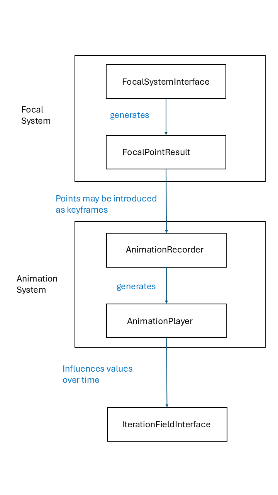